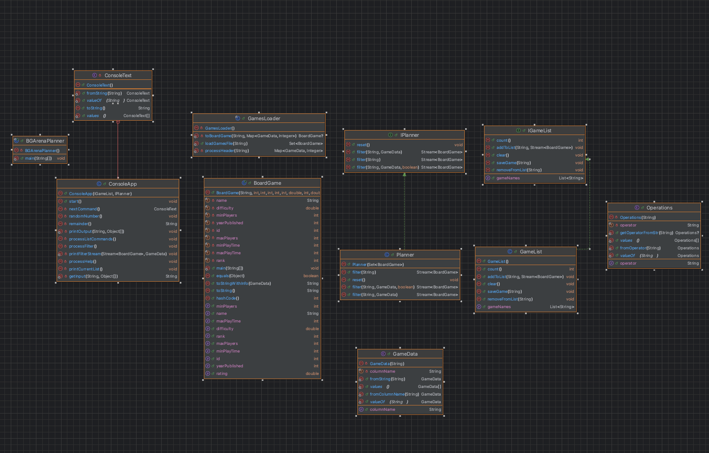
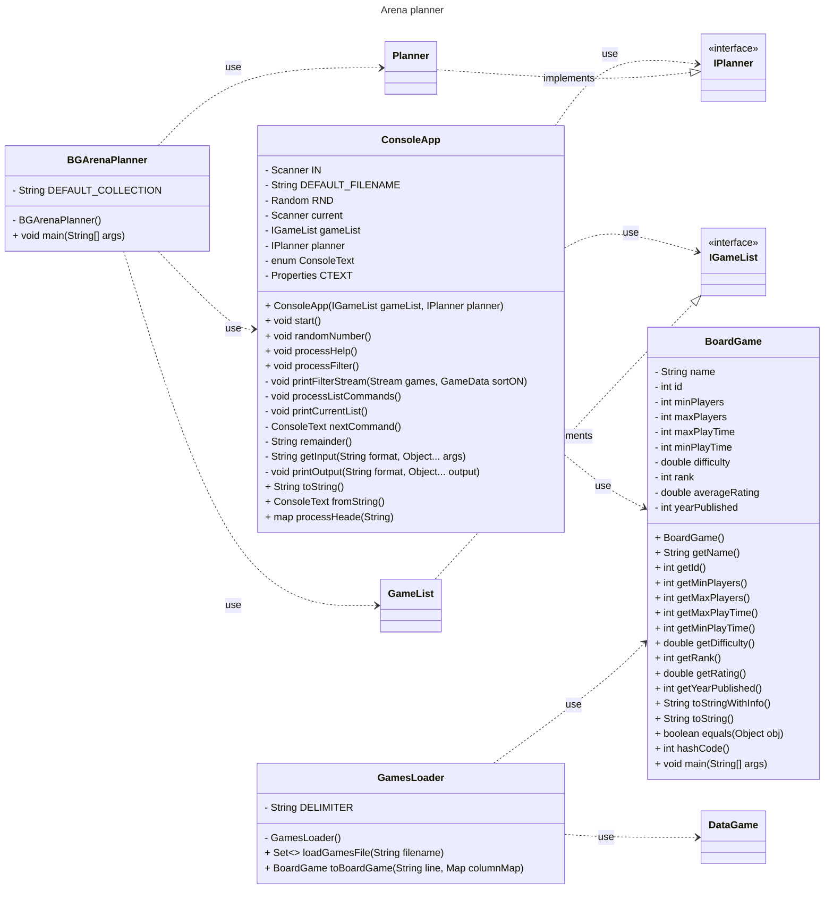

# Board Game Arena Planner Design Document

This document is meant to provide a tool for you to demonstrate the design process. You need to work on this before you code, and after have a finished product. That way you can compare the changes, and changes in design are normal as you work through a project. It is contrary to popular belief, but we are not perfect our first attempt. We need to iterate on our designs to make them better. This document is a tool to help you do that.

## (INITIAL DESIGN): Class Diagram 

Place your class diagrams below. Make sure you check the file in the browser on github.com to make sure it is rendering correctly. If it is not, you will need to fix it. As a reminder, here is a link to tools that can help you create a class diagram: [Class Resources: Class Design Tools](https://github.com/CS5004-khoury-lionelle/Resources?tab=readme-ov-file#uml-design-tools)

### Provided Code

Provide a class diagram for the provided code as you read through it.  For the classes you are adding, you will create them as a separate diagram, so for now, you can just point towards the interfaces for the provided code diagram.

### Your Plans/Design

Create a class diagram for the classes you plan to create. This is your initial design, and it is okay if it changes. Your starting points are the interfaces.
A ..> B : uses

A -- B : has

ClassA --|> BaseClass  : extends

ClassA ..|> MyInterface : implements

## (INITIAL DESIGN): Tests to Write - Brainstorm

Write a test (in english) that you can picture for the class diagram you have created. This is the brainstorming stage in the TDD process. 

> [!TIP]
> As a reminder, this is the TDD process we are following:
> 1. Figure out a number of tests by brainstorming (this step)
> 2. Write **one** test
> 3. Write **just enough** code to make that test pass
> 4. Refactor/update  as you go along
> 5. Repeat steps 2-4 until you have all the tests passing/fully built program

You should feel free to number your brainstorm. 

1. Test 1..class Planner 
* filter(String filter) method:
  for this method, we need a test that we put a text input and filter result will be all the board games with this text input.Assumes the results are sorted in
  ascending order.like : filter(season) will output "zelda season 1" "zelda season 2" "final fantasy season 7"......
* filter(String filter, GameData sortOn) method: base on the one game data ,filter result will be all the board games with this text input.
* filter(String filter, GameData sortOn, boolean ascending):we need a test that can contain some arithmetic comparison.like: minPlayers>4 would filter the board games to only those with a minimum number of players greater than 4.
* reset():test will resets the collection to have no filters applied.
2. Test 2.. class GameList
* assume my game list is already have 4 : [zelda season 1,zelda season 2,Wu Kong:Black Myth,final fantasy season 7]
* getGameNames():show all the content in the list.Output should be "zelda season 1","zelda season 2","Wu Kong:Black Myth","final fantasy season 7".
* count():Count the number of games in the list.Output should be 4.
* saveGame(String filename):Save the list of this 4 games to a local file.
* addToList(String str, Stream<BoardGame> filtered): Put the filtered game into my game list through number. Assume the filtered list is [game1,game2,game3,game4,game5].
  * str = 1, add game1 to my game list.
  * str = 2, add game2 to my game list.
  * str = 1-3, add game1,game2 and game3 to my game list.
  * str = all, add all 5 games in my game list.
  * str = 6, throw an exception because we just have 5 in our filtered list.
* removeFromList(String str):remove the element in the current game list. Assume my game list is already have 4 : [zelda season 1,zelda season 2,Wu Kong:Black Myth,final fantasy season 7]
  * str = 1, delete zelda season 1.
  * str = 1-3,delete zelda season 1,zelda season 2 and Wu Kong:Black Myth from my game list.
  * str = all, empty my game list.
  * str = 5, throw an exception because we just have 4 in our filtered list.c

## (FINAL DESIGN): Class Diagram

Go through your completed code, and update your class diagram to reflect the final design. Make sure you check the file in the browser on github.com to make sure it is rendering correctly. It is normal that the two diagrams don't match! Rarely (though possible) is your initial design perfect. 

For the final design, you just need to do a single diagram that includes both the original classes and the classes you added. 

> [!WARNING]
> If you resubmit your assignment for manual grading, this is a section that often needs updating. You should double check with every resubmit to make sure it is up to date.

## (FINAL DESIGN): Reflection/Retrospective

> [!IMPORTANT]
> The value of reflective writing has been highly researched and documented within computer science, from learning to information to showing higher salaries in the workplace. For this next part, we encourage you to take time, and truly focus on your retrospective.

Take time to reflect on how your design has changed. Write in *prose* (i.e. do not bullet point your answers - it matters in how our brain processes the information). Make sure to include what were some major changes, and why you made them. What did you learn from this process? What would you do differently next time? What was the most challenging part of this process? For most students, it will be a paragraph or two. 
